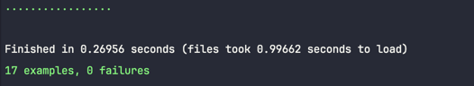

# Discover Country

This is a test for IOB company.

It was designed thiking find out country that was in database. 

## Stack

- Rails 7.1.3
- Ruby 3.2.2
- Postgres
- JWT for authentication
- GraphQL

## Building application

Ok, so first you must have:

1. Postgres installed.

2. Ruby >= 3.2.2 installed (minimum required for Rails 7.1.3, version we're working with).

3. As we're on the beginning of project, don't forget to right configure your `datatabe.yml`.

4. And to *bundle* it with command:

```
bundle install
```
As soon as you have everything done you can follow

### Manually building everything

If you want to rock and create your dev environment and data, it's possible to go through the usual way

1. Create databases
```
rails db:create
```

2. Run migrations
```
rails db:migrate
```

3. Run seed
```
rails db:seed
```

4. Start the server
```
rails s
```

If you want to run tests:



```
bundle exec rspec
```

## 🚀 Thanks for opportunity 🚀
